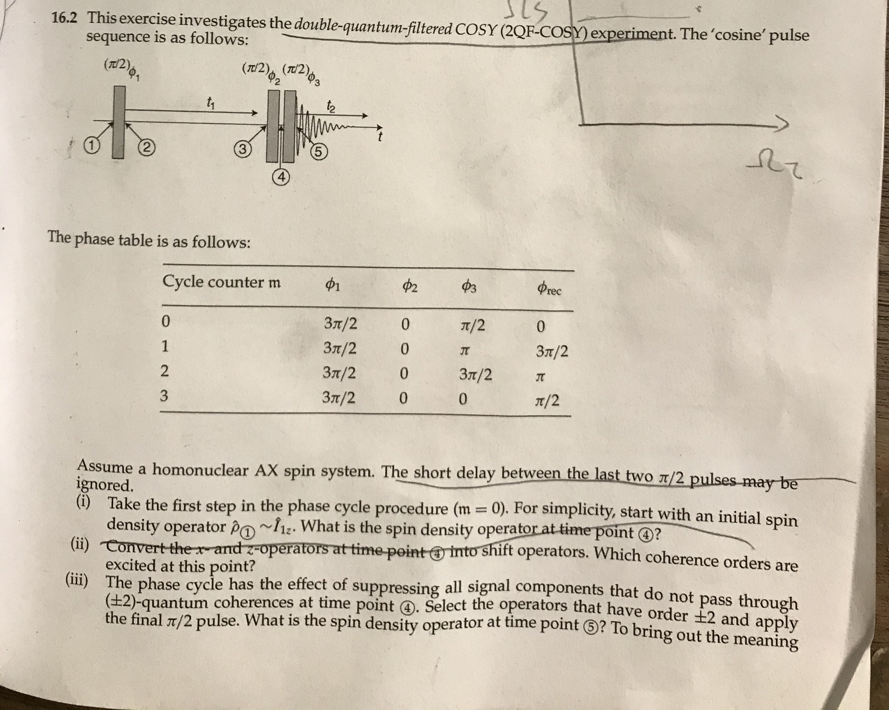
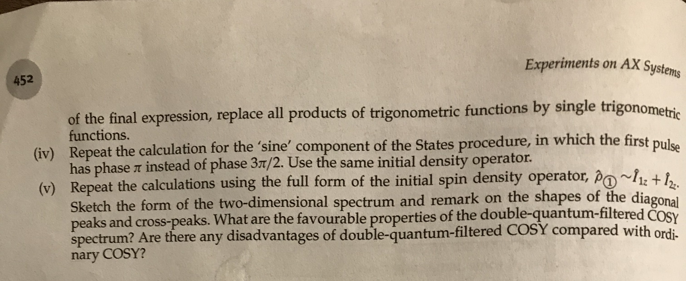

# Solution to Exercise 16.2 from Spin Dynamics (2nd, Malcolm H. Levitt)

Zheng Zuo

April 2nd, 2020

[TOC]

## The Problem 16.2 in book Spin Dynamics (p.451-452)

## Pulse sequence for 2QF-COSY (double-quantum-filtered COSY)

- | Cycle counter m | $\phi_1$ | $\phi_2$ | $\phi_3$ | $\phi_{rec}$ |
  | :-------------: | -------- | -------- | -------- | ------------ |
  |        0        | $3\pi/2$ | 0        | $\pi/2$  | 0            |
  |        1        | $3\pi/2$ | 0        | $\pi$    | $3\pi/2$     |
  |        2        | $3\pi/2$ | 0        | $3\pi/2$ | $\pi$        |
  |        3        | $3\pi/2$ | 0        | 0        | $\pi/2$      |

## Calculation of density product operator(s)

### (i, ii, iii) The product operators in cosine version pulse sequence (cycle m=0)

$$
\begin{aligned}
\hat{\rho}_{1} & = \hat{I}_{1z} \\
			& \downarrow_{\left(\pi/2\right)_{-y}} \\
\hat{\rho}_{2} & = -\hat{I}_{1x} \\
			& \downarrow_{U2} \\
              & -\hat{I}_{1x}\\
            & \downarrow_{U1} \\
              & -\hat{I}_{1x} \cos(\Omega_1 t_1) -\hat{I}_{1y} \sin(\Omega_1 t_1) \\
            & \downarrow_{J_{12}} \\
 \hat{\rho}_{3} & = -\cos(\Omega_1 t_1) [\cos(\pi J t_1) \hat{I}_{1x} +  \sin(\pi J t_1) 2  \hat{I}_{1y}  \hat{I}_{2z}]\\
              & +\sin(\Omega_1 t_1) [-\cos(\pi J t_1) \hat{I}_{1y} +  \sin(\pi J t_1) 2  \hat{I}_{1x} \hat{I}_{2z}] \\
& \downarrow_{\left(\pi/2\right)_{x}} \\

\hat{\rho}_{4}  & = -\cos(\Omega t_1) [\cos(\pi J t_1) \hat{I}_{1x} -  \sin(\pi J t_1) 2\textcolor{red}{\hat{I}_{1z} \hat{I}_{2y}}] \\
              & +\sin(\Omega_1 t_1) [-\cos(\pi J t_1) \textcolor{red}{\hat{I}_{1z}} -  \underbrace{\sin(\pi J t_1) 2  \hat{I}_{1x} \textcolor{red}{\hat{I}_{2y}}}_{Double\ coherence}] \\ 
              
\hat{\rho}_{4,\pm 2}  & = - \sin(\Omega_1 t_1) \sin(\pi J t_1) 2  \hat{I}_{1x} \hat{I}_{2y} \\	 
& \downarrow_{\left(\pi/2\right)_{y}} \\

\hat{\rho}_{5,\cos}  & = \sin(\Omega_1 t_1) \sin(\pi J t_1) 2  \textcolor{red}{\hat{I}_{1z}} \hat{I}_{2y} \\
			  & = [\cos(\Omega_1 t_1 - \pi J t_1) - \cos(\Omega_1 t_1 + \pi J t_1)] \hat{I}_{1z} \hat{I}_{2y}
\end{aligned}
$$

### (iv) The product operators for the sine version pulse sequences

$$
\begin{aligned}
\hat{\rho}_{1} & = \hat{I}_{1z} \\
			& \downarrow_{\left(\pi/2\right)_{-x}} \\
\hat{\rho}_{2} & = -\hat{I}_{1y} \\
			& \downarrow_{U2} \\
              & -\hat{I}_{1y}\\
            & \downarrow_{U1} \\
              & -\hat{I}_{1y} \cos(\Omega_1 t_1) -\hat{I}_{1x} \sin(\Omega_1 t_1) \\
            & \downarrow_{J_{12}} \\
 \hat{\rho}_{3} & = \cos(\Omega_1 t_1) [\cos(\pi J t_1) \hat{I}_{1y} -  \sin(\pi J t_1) 2  \hat{I}_{1x}  \hat{I}_{2z}]\\
              & -\sin(\Omega_1 t_1) [\cos(\pi J t_1) \hat{I}_{1x} +  \sin(\pi J t_1) 2  \hat{I}_{1y} \hat{I}_{2z}] \\
& \downarrow_{\left(\pi/2\right)_{x}} \\
\hat{\rho}_{4}  & = \cos(\Omega t_1) [\cos(\pi J t_1) \textcolor{red}{\hat{I}_{1z}} +  \underbrace{\sin(\pi J t_1) 2  \hat{I}_{1x} \textcolor{red}{\hat{I}_{2y}}}_{Double\ coherence}] \\
              & -\sin(\Omega_1 t_1) [\cos(\pi J t_1) \hat{I}_{1x} -  \sin(\pi J t_1) 2  \textcolor{red}{\hat{I}_{1z} \hat{I}_{2y}}] \\ 
              
\hat{\rho}_{4,\pm 2}  & = \cos(\Omega_1 t_1) \sin(\pi J t_1) 2  \hat{I}_{1x} \hat{I}_{2y} \\	 
& \downarrow_{\left(\pi/2\right)_{y}} \\
\hat{\rho}_{5,\sin}  & = -\cos(\Omega_1 t_1) \sin(\pi J t_1) 2  \textcolor{red}{\hat{I}_{1z}} \hat{I}_{2y} \\
			  & = [\sin(\Omega_1 t_1 - \pi J t_1) - \sin(\Omega_1 t_1 + \pi J t_1)] \hat{I}_{1z} \hat{I}_{2y}
\end{aligned}
$$

### Construction of phase-sensitive 2D peaks according to States Method

$$
\begin{aligned}
\hat{\rho}_{States} & = \hat{\rho}_{\cos} + i\ \hat{\rho}_{\sin} \\
					& = [\exp^{i(\Omega_1 - \pi J)t_1}-\exp^{i(\Omega_1 + \pi J)t_1}]\hat{I}_{1z} \hat{I}_{2y} \\
					& = [\exp^{i(\Omega_1 - \pi J)t_1}-\exp^{i(\Omega_1 + \pi J)t_1}] 
					\textcolor{red}{[\underbrace{\frac{i}{4} \hat{I}_1^\alpha \hat{I}_2^-}_{\hat{\rho}_{\alpha-}} - \underbrace{\frac{i}{4} \hat{I}_1^\beta \hat{I}_2^-}_{\hat{\rho}_{\beta-}} + ... ]}\\
\end{aligned}
$$

Density operator $ \hat{I}_{1z} \hat{I}_{2y} $ indicates an antiphase absorption peak, centered around frequency $\Omega_2^0$ in the $\Omega_2$ dimension. Therefore, equation signifies the doubly antiphase cross-peak, jus like in the normal COSY scenario.

### (v) Using initial density operator $\hat{I}_{2z}$

For the full form of initial spin density operator $ \hat{\rho}_1 \sim \hat{I}_{1z} + \hat{I}_{2z} $ , if we starts with $\hat{I}_{2z}$,
$$
\begin{aligned}
\hat{\rho}_{1} & = \hat{I}_{2z} \\
			& \downarrow_{\left(\pi/2\right)_{-y}} \\
\hat{\rho}_{2} & = -\hat{I}_{2x} \\
			& \downarrow_{U2} \\
			& -\hat{I}_{2x} \cos(\Omega_1 t_1) -\hat{I}_{2y} \sin(\Omega_1 t_1) \\
            & \downarrow_{U1} \\
            & -\hat{I}_{2x} \cos(\Omega_1 t_1) -\hat{I}_{2y} \sin(\Omega_1 t_1) \\
            & \downarrow_{J_{12}} \\
 \hat{\rho}_{3} & = -\cos(\Omega_1 t_1) [\cos(\pi J t_1) \hat{I}_{2x} +  \sin(\pi J t_1) 2  \hat{I}_{1z}  \hat{I}_{2y}]\\
              & +\sin(\Omega_1 t_1) [-\cos(\pi J t_1) \hat{I}_{2y} +  \sin(\pi J t_1) 2  \hat{I}_{1z} \hat{I}_{2x}] \\
& \downarrow_{\left(\pi/2\right)_{x}} \\

\hat{\rho}_{4}  & = -\cos(\Omega t_1) [\cos(\pi J t_1) \hat{I}_{2x} -  \sin(\pi J t_1) 2 \textcolor{red}{\hat{I}_{1y} \hat{I}_{2z}}] \\
              & +\sin(\Omega_1 t_1) [-\cos(\pi J t_1) \textcolor{red}{\hat{I}_{2z}} -  \underbrace{\sin(\pi J t_1) 2 \textcolor{red}{\hat{I}_{1y}} \hat{I}_{2x}}_{Double\ coherence}] \\ 
              
\hat{\rho}_{4,\pm 2}  & = - \sin(\Omega_1 t_1) \sin(\pi J t_1) 2  \hat{I}_{1y} \hat{I}_{2x} \\	 
& \downarrow_{\left(\pi/2\right)_{y}} \\

\hat{\rho}_{5,\cos}  & = \sin(\Omega_1 t_1) \sin(\pi J t_1) 2  \hat{I}_{1y} \textcolor{red}{\hat{I}_{2z}} \\
			  & = [\cos(\Omega_1 t_1 - \pi J t_1) - \cos(\Omega_1 t_1 + \pi J t_1)] \hat{I}_{1y} \hat{I}_{2z}
\end{aligned}
$$
Similarly, for the sine version of pulse sequence,
$$
\begin{aligned}
\hat{\rho}_{1} & = \hat{I}_{2z} \\
			& \downarrow_{\left(\pi/2\right)_{-x}} \\
\hat{\rho}_{2} & = -\hat{I}_{2y} \\
			& \downarrow_{U2} \\
              & -\hat{I}_{2y} \cos(\Omega_1 t_1) -\hat{I}_{2x} \sin(\Omega_1 t_1) \\
            & \downarrow_{U1} \\
              & -\hat{I}_{2y} \cos(\Omega_1 t_1) -\hat{I}_{2x} \sin(\Omega_1 t_1) \\
            & \downarrow_{J_{12}} \\
 \hat{\rho}_{3} & = \cos(\Omega_1 t_1) [\cos(\pi J t_1) \hat{I}_{2y} -  \sin(\pi J t_1) 2  \hat{I}_{1z}  \hat{I}_{2x}]\\
              & -\sin(\Omega_1 t_1) [\cos(\pi J t_1) \hat{I}_{2x} +  \sin(\pi J t_1) 2  \hat{I}_{1z} \hat{I}_{2y}] \\
& \downarrow_{\left(\pi/2\right)_{x}} \\

\hat{\rho}_{4}  & = \cos(\Omega t_1) [\cos(\pi J t_1) \textcolor{red}{\hat{I}_{2z}} +  \underbrace{\sin(\pi J t_1) 2  \textcolor{red}{\hat{I}_{1y}} \hat{I}_{2x}}_{Double\ coherence}] \\
              & -\sin(\Omega_1 t_1) [\cos(\pi J t_1) \hat{I}_{2x} -  \sin(\pi J t_1) 2  \textcolor{red}{\hat{I}_{1y} \hat{I}_{2z}}] \\ 
              
\hat{\rho}_{4,\pm 2}  & = \cos(\Omega_1 t_1) \sin(\pi J t_1) 2  \hat{I}_{1y} \hat{I}_{2x} \\	 
& \downarrow_{\left(\pi/2\right)_{y}} \\

\hat{\rho}_{5,\sin}  & = -\cos(\Omega_1 t_1) \sin(\pi J t_1) 2  \hat{I}_{1y} \textcolor{red}{ \hat{I}_{2z}} \\
			  & = [\sin(\Omega_1 t_1 - \pi J t_1) - \sin(\Omega_1 t_1 + \pi J t_1)] \hat{I}_{1y} \hat{I}_{2z}
\end{aligned}
$$
Overall,
$$
\begin{aligned}
\hat{\rho}_{States} & = \hat{\rho}_{\cos} + i\ \hat{\rho}_{\sin} \\
					& = [\exp^{i(\Omega_1 - \pi J)t_1}-\exp^{i(\Omega_1 + \pi J)t_1}]\hat{I}_{1y} \hat{I}_{2z} \\
					& = [\exp^{i(\Omega_1 - \pi J)t_1}-\exp^{i(\Omega_1 + \pi J)t_1}] 
					\textcolor{red}{[\underbrace{\frac{i}{4} \hat{I}_1^- \hat{I}_2^\alpha}_{\hat{\rho}_{-\alpha}} - \underbrace{\frac{i}{4} \hat{I}_1^- \hat{I}_2^\beta}_{\hat{\rho}_{-\beta}} + ... ]}\\
\end{aligned}
$$
Density operator $ \hat{I}_{1y} \hat{I}_{2z} $ indicates an antiphase absorption peak, centered around frequency $\Omega_1^0$ in the $\Omega_2$ dimension. Therefore, equation signifies the doubly antiphase diagonal peaks, which is different from the normal COSY scenario.

## The form of DQF-COSY peaks

.png)