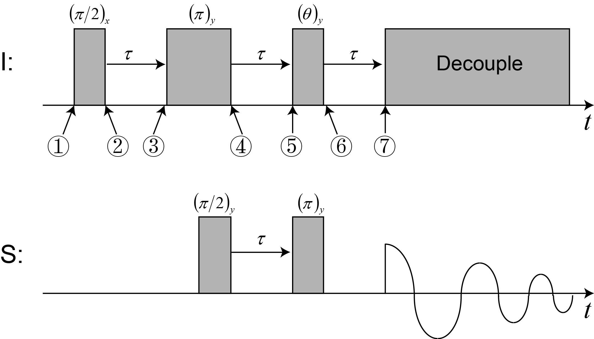

# Comparison of spin density operators evolution of  $I S$, $I_2 S$ , and $I_3 S$ systems under DEPT pulse sequence

Zheng Zuo

April 9, 2020

[TOC]

## Exercise 18.1 in Spin Dynamics (Malcolm H. Levitt, 2ed)

## Pulse sequences diagram

## Spin density operators evolution

### Back-to-back comparison between $IS$ and $I_2S$

$$
\begin{aligned}
&\textcolor{red}{I S} &&\textcolor{cyan}{I_2 S} \\
\hat{\rho}_1 &= \hat{I}_{z} && \hat{I}_{1z}\\
&\downarrow{(\pi/2)_x}\ on\ I \\

\hat{\rho}_2 &= -\hat{I}_{y} \\
& \downarrow{J_{IS}} \\
& 2 \hat{I}_{x} \hat{S}_{z} \\
& \downarrow{U_{I}} \\

\hat{\rho}_3 &= 2\textcolor{red}{\left[\cos \left(\Omega_{I} \tau\right) \hat{I}_{x} + \sin \left(\Omega_{I} \tau\right) \hat{I}_{y} \right ]} \hat{S}_{z} \\
&\downarrow{(\pi)_y}\ on\ I\\

& \ \ \ \ 2\left[\textcolor{red}{-}\cos \left(\Omega_{I} \tau\right) \hat{I}_{x} + \sin \left(\Omega_{I} \tau\right) \hat{I}_{y} \right ] \hat{S}_{z} \\

\hat{\rho}_4  &= 2\left[-\cos \left(\Omega_{I} \tau\right) \hat{I}_{x} + \sin \left(\Omega_{I} \tau\right) \hat{I}_{y} \right ] \textcolor{red}{\hat{S}_{x}} &&
2\left[-\cos \left(\Omega_{I} \tau\right) \hat{I}_{1x} + \sin \left(\Omega_{I} \tau\right) \hat{I}_{1y} \right ] \textcolor{red}{\hat{S}_{x}}\\
& \downarrow{J_{IS}} && \downarrow{J_{I_1 S}}\\
& No\ effect && No\ effect\\
& \downarrow{U_{I}} &&  \downarrow{U_{I_1}}  \\

& 2\textcolor{red}{-\hat{I}_{x}} \hat{S}_{x} &&
  2\textcolor{red}{-\hat{I}_{1x}} \hat{S}_{x}  \\
& \downarrow{U_S} && \downarrow{U_S}\\

& -2\hat{I}_{x}\textcolor{red}{\left[\cos \left(\Omega_{S} \tau\right) \hat{S}_{x} + \sin \left(\Omega_{S} \tau\right) \hat{S}_{y} \right ]} &&
-2\hat{I}_{1x}\textcolor{red}{\left[\cos \left(\Omega_{S} \tau\right) \hat{S}_{x} + \sin \left(\Omega_{S} \tau\right) \hat{S}_{y} \right ]}\\
& && \textcolor{cyan}{\downarrow{J_{I_2 S}}}\\

\hat{\rho}_5 &  &&
-2\hat{I}_{1x} \textcolor{cyan}{2\hat{I}_{2z}} \left[\cos \left(\Omega_S \tau\right) \textcolor{cyan} {\hat{S}_{y} -} \sin \left(\Omega_{S} \tau\right) \textcolor{cyan}{\hat{S}_{x}} \right ]\\

&\downarrow{(\pi)_y\ on\ S} && \downarrow{(\pi)_y\ on\ S} \\
&\ \ \ \ \ \  -2\hat{I}_{x}\left[\textcolor{red}-\cos \left(\Omega_{S} \tau\right) \hat{S}_{x} + \sin \left(\Omega_{S} \tau\right) \hat{S}_{y} \right ] &&
-2\hat{I}_{1x} 2\hat{I}_{2z} \left[\cos \left(\Omega_S \tau\right) \hat{S}_{y} \textcolor{red}+ \sin \left(\Omega_{S} \tau\right) \hat{S}_{x} \right ]\\

&\downarrow{(\theta)_y\ on\ I} && \downarrow{(\theta)_y\ on\ I_1}\\
&                              && -2\textcolor{red}{\left[\cos \left(\theta\right) \hat{I}_{1x} - \sin \left(\theta\right) \hat{I}_{1z}\right]} 2\hat{I}_{2z} \left[\cos \left(\Omega_S \tau\right) \hat{S}_{y} + \sin \left(\Omega_{S} \tau\right) \hat{S}_{x} \right ]\\                  
&                              && \textcolor{cyan}{\downarrow{(\theta)_y\ on\ I_2}}\\

\hat{\rho}_6 &= -2\textcolor{red}{\left[\cos \left(\theta\right) \hat{I}_{x} - \sin \left(\theta\right) \hat{I}_{z}\right]}\left[-\cos \left(\Omega_S \tau\right) \hat{S}_{x} + \sin \left(\Omega_S \tau\right) \hat{S}_{y} \right ] &&
-2\left[\cos \left(\theta\right) \hat{I}_{1x} - \sin \left(\theta\right) \hat{I}_{1z}\right]  2\textcolor{cyan}{\left[\sin \left(\theta\right) \hat{I}_{2x} + \cos \left(\theta\right) \hat{I}_{2z}\right]} \left[\cos \left(\Omega_S \tau\right) \hat{S}_{y} + \sin \left(\Omega_{S} \tau\right) \hat{S}_{x} \right ]\\

& \downarrow{U_{S}} && \downarrow{U_{S}} \\
& -2\left[\cos \left(\theta\right) \hat{I}_{x} - \sin \left(\theta\right) \hat{I}_{z}\right] \textcolor{red}{-\hat{S}_{x}} &&
-2\left[\cos \left(\theta\right) \hat{I}_{1x} - \sin \left(\theta\right) \hat{I}_{1z}\right]  2\left[\sin \left(\theta\right) \hat{I}_{2x} + \cos \left(\theta\right) \hat{I}_{2z}\right] \textcolor{red}{\hat{S}_y}\\

& \downarrow{U_I} && \downarrow{U_{I_1}} + \downarrow{U_{I_2}}\\
&\ \ \ \   2\left[\textcolor{red}{ \cos \left(\theta\right) \cos \left(\Omega_I\tau\right) \hat{I}_{x} + \cos \left(\theta\right) \sin \left(\Omega_I\tau\right) \hat{I}_{y} } - \sin \left(\theta\right) \hat{I}_{z}\right] \hat{S}_{x} &&
\textcolor{cyan}{...} + 4\sin(\theta)\cos(\theta) \hat{I}_{1z} \hat{I}_{2z} \hat{S}_y\\

& \downarrow{J_{IS}} && \downarrow{J_{{I_1}S}} + \textcolor{cyan}{\downarrow{J_{{I_2}S}}}\\
 
\hat{\rho}_7 &= 2\left[\cos \left(\theta\right) \cos \left(\Omega_I\tau\right) \hat{I}_{x} + \cos \left(\theta\right) \sin \left(\Omega_I\tau\right) \hat{I}_{y} \right] \hat{S}_{x} - \underbrace {\textcolor{red} {\sin \left(\theta\right) \hat{S}_y} }_{(\pm 1 \ coherence)} &&
... \underbrace{\textcolor{cyan}{- \sin(\theta)\cos(\theta) \hat{S}_y}}_{(\pm 1 \ coherence)}\\
\end{aligned}
$$

### Back-to-back comparison between $IS$ , $I_2S$, and $I_3S$

$$
\begin{aligned}
&\textcolor{red}{I S} &&\textcolor{cyan}{I_2 S} &&&\textcolor{orange}{I_3 S}\\

\hat{\rho}_1 &= \hat{I}_{z} && \hat{I}_{1z} &&& \hat{I}_{1z}\\
&\downarrow{(\pi/2)_x}\ on\ I \\

\hat{\rho}_2 &= -\hat{I}_{y} \\
& \downarrow{J_{IS}} \\
& 2 \hat{I}_{x} \hat{S}_{z} \\
& \downarrow{U_{I}} \\

\hat{\rho}_3 &= 2\textcolor{red}{\left[\cos \left(\Omega_{I} \tau\right) \hat{I}_{x} + \sin \left(\Omega_{I} \tau\right) \hat{I}_{y} \right ]} \hat{S}_{z} \\
&\downarrow{(\pi)_y}\ on\ I\\

& \ \ \ \ 2\left[\textcolor{red}{-}\cos \left(\Omega_{I} \tau\right) \hat{I}_{x} + \sin \left(\Omega_{I} \tau\right) \hat{I}_{y} \right ] \hat{S}_{z} \\

\hat{\rho}_4  &= 2\left[-\cos \left(\Omega_{I} \tau\right) \hat{I}_{x} + \sin \left(\Omega_{I} \tau\right) \hat{I}_{y} \right ] \textcolor{red}{\hat{S}_{x}} &&
2\left[-\cos \left(\Omega_{I} \tau\right) \hat{I}_{1x} + \sin \left(\Omega_{I} \tau\right) \hat{I}_{1y} \right ] \textcolor{red}{\hat{S}_{x}}\\
& \downarrow{J_{IS}} && \downarrow{J_{I_1 S}}\\
& No\ effect && No\ effect\\
& \downarrow{U_{I}} &&  \downarrow{U_{I_1}}  \\

& 2\textcolor{red}{-\hat{I}_{x}} \hat{S}_{x} &&
  2\textcolor{red}{-\hat{I}_{1x}} \hat{S}_{x}  \\
& \downarrow{U_S} && \downarrow{U_S}\\

&  -2\hat{I}_{x}\textcolor{red}{\left[\cos \left(\Omega_{S} \tau\right) \hat{S}_{x} + \sin \left(\Omega_{S} \tau\right) \hat{S}_{y} \right ]} &&
-2\hat{I}_{1x}\textcolor{red}{\left[\cos \left(\Omega_{S} \tau\right) \hat{S}_{x} + \sin \left(\Omega_{S} \tau\right) \hat{S}_{y} \right ]}\\

& && \textcolor{cyan}{\downarrow{J_{I_2 S}}} &&& \textcolor{cyan}{\downarrow{J_{I_2 S}}}\\
& && -2\hat{I}_{1x} \textcolor{cyan}{2\hat{I}_{2z}} \left[\cos \left(\Omega_S \tau\right) \textcolor{cyan} {\hat{S}_{y} -} \sin \left(\Omega_{S} \tau\right) \textcolor{cyan}{\hat{S}_{x}} \right ] &&&
-2\hat{I}_{1x} \textcolor{cyan}{2\hat{I}_{2z}} \left[\cos \left(\Omega_S \tau\right) \textcolor{cyan} {\hat{S}_{y} -} \sin \left(\Omega_{S} \tau\right) \textcolor{cyan}{\hat{S}_{x}} \right ]\\

& && &&& \textcolor{orange}{\downarrow{J_{I_3 S}}} \\

\hat{\rho}_5 & && &&&
2\hat{I}_{1x} 2\hat{I}_{2z} \textcolor{orange}{2\hat{I}_{3z}} \left[\cos \left(\Omega_S \tau\right) \textcolor{orange} {\hat{S}_{x}} + \sin \left(\Omega_{S} \tau\right) \textcolor{orange}{\hat{S}_{y}} \right ]\\

&\downarrow{(\pi)_y\ on\ S} && \downarrow{(\pi)_y\ on\ S}  &&& \downarrow{(\pi)_y\ on\ S} \\
&\ \ \ \ \ \  -2\hat{I}_{x}\left[\textcolor{red}-\cos \left(\Omega_{S} \tau\right) \hat{S}_{x} + \sin \left(\Omega_{S} \tau\right) \hat{S}_{y} \right ] &&
-2\hat{I}_{1x} 2\hat{I}_{2z} \left[\cos \left(\Omega_S \tau\right) \hat{S}_{y} \textcolor{red}+ \sin \left(\Omega_{S} \tau\right) \hat{S}_{x} \right ] &&&
2\hat{I}_{1x} 2\hat{I}_{2z} 2\hat{I}_{3z} \left[\textcolor{red}- \cos \left(\Omega_S \tau\right) \hat{S}_{x} + \sin \left(\Omega_{S} \tau\right) \hat{S}_{y} \right ]\\

&\downarrow{(\theta)_y\ on\ I} && \downarrow{(\theta)_y\ on\ I_1} &&& \downarrow{(\theta)_y\ on\ I_1}\\
&                              && -2\textcolor{red}{\left[\cos \left(\theta\right) \hat{I}_{1x} - \sin \left(\theta\right) \hat{I}_{1z}\right]} 2\hat{I}_{2z} \left[\cos \left(\Omega_S \tau\right) \hat{S}_{y} + \sin \left(\Omega_{S} \tau\right) \hat{S}_{x} \right ] &&&
2 \textcolor{red}{\left[\cos \left(\theta\right) \hat{I}_{1x} - \sin \left(\theta\right) \hat{I}_{1z}\right] } 2\hat{I}_{2z} 2\hat{I}_{3z} \left[ \cos \left(\Omega_S \tau\right) \hat{S}_{x} + \sin \left(\Omega_{S} \tau\right) \hat{S}_{y} \right ]\\

&                              && \textcolor{cyan}{\downarrow{(\theta)_y\ on\ I_2}} &&& \textcolor{cyan}{\downarrow{(\theta)_y\ on\ I_2}}\\

&                              && &&& \textcolor{orange}{\downarrow{(\theta)_y\ on\ I_3}}\\

\hat{\rho}_6 &= -2\textcolor{red}{\left[\cos \left(\theta\right) \hat{I}_{x} - \sin \left(\theta\right) \hat{I}_{z}\right]}\left[-\cos \left(\Omega_S \tau\right) \hat{S}_{x} + \sin \left(\Omega_S \tau\right) \hat{S}_{y} \right ] &&
-2\left[\cos \left(\theta\right) \hat{I}_{1x} - \sin \left(\theta\right) \hat{I}_{1z}\right]  2\textcolor{cyan}{\left[\sin \left(\theta\right) \hat{I}_{2x} + \cos \left(\theta\right) \hat{I}_{2z}\right]} \left[\cos \left(\Omega_S \tau\right) \hat{S}_{y} + \sin \left(\Omega_{S} \tau\right) \hat{S}_{x} \right ] &&&
2 \left[\cos \left(\theta\right) \hat{I}_{1x} - \sin \left(\theta\right) \hat{I}_{1z}\right]  2\textcolor{cyan}{\left[\sin \left(\theta\right) \hat{I}_{2x} + \cos \left(\theta\right) \hat{I}_{2z}\right]} 2\textcolor{orange}{\left[\sin \left(\theta\right) \hat{I}_{3x} + \cos \left(\theta\right) \hat{I}_{3z}\right]} \left[ \cos \left(\Omega_S \tau\right) \hat{S}_{x} + \sin \left(\Omega_{S} \tau\right) \hat{S}_{y} \right ]\\

& \downarrow{U_{S}} && \downarrow{U_{S}} &&& \downarrow{U_{S}} \\
& -2\left[\cos \left(\theta\right) \hat{I}_{x} - \sin \left(\theta\right) \hat{I}_{z}\right] \textcolor{red}{-\hat{S}_{x}} &&
-2\left[\cos \left(\theta\right) \hat{I}_{1x} - \sin \left(\theta\right) \hat{I}_{1z}\right]  2\left[\sin \left(\theta\right) \hat{I}_{2x} + \cos \left(\theta\right) \hat{I}_{2z}\right] \textcolor{red}{\hat{S}_y} &&&
2 \left[\cos \left(\theta\right) \hat{I}_{1x} - \sin \left(\theta\right) \hat{I}_{1z}\right]  2\left[\sin \left(\theta\right) \hat{I}_{2x} + \cos \left(\theta\right) \hat{I}_{2z}\right] 2\left[\sin \left(\theta\right) \hat{I}_{3x} + \cos \left(\theta\right) \hat{I}_{3z}\right] \textcolor{red}{\left[ \cos \left(2\Omega_S \tau\right) \hat{S}_{x} + \sin \left(2\Omega_{S} \tau\right) \hat{S}_{y} \right ]}\\

& \downarrow{U_I} && \downarrow{U_{I_1}} + \downarrow{U_{I_2}} &&& \downarrow{U_{I_1}} + \downarrow{U_{I_2}} + \downarrow{U_{I_3}}\\
&\ \ \ \   2\left[\textcolor{red}{ \cos \left(\theta\right) \cos \left(\Omega_I\tau\right) \hat{I}_{x} + \cos \left(\theta\right) \sin \left(\Omega_I\tau\right) \hat{I}_{y} } - \sin \left(\theta\right) \hat{I}_{z}\right] \hat{S}_{x} &&
\textcolor{cyan}{...} + 4\sin(\theta)\cos(\theta) \hat{I}_{1z} \hat{I}_{2z} \hat{S}_y &&&
\textcolor{orange}{...} -8 \sin\theta (\cos\theta)^2 \hat{I}_{1z} \hat{I}_{2z} \hat{I}_{3z} \left[ \cos \left(2\Omega_S \tau\right) \hat{S}_{x} + \sin \left(2\Omega_{S} \tau\right) \hat{S}_{y} \right ]\\

& \downarrow{J_{IS}} && \downarrow{J_{{I_1}S}} + \textcolor{cyan}{\downarrow{J_{{I_2}S}}} &&&
\downarrow{J_{{I_1}S}} + \textcolor{cyan}{\downarrow{J_{{I_2}S}}} + \textcolor{orange}{\downarrow{J_{{I_3}S}}}\\
 
\hat{\rho}_7 &= 2\left[\cos \left(\theta\right) \cos \left(\Omega_I\tau\right) \hat{I}_{x} + \cos \left(\theta\right) \sin \left(\Omega_I\tau\right) \hat{I}_{y} \right] \hat{S}_{x} - \underbrace {\textcolor{red} {\sin \left(\theta\right) \hat{S}_y} }_{(\pm 1 \ coherence)} &&
... \underbrace{\textcolor{cyan}{- \sin(\theta)\cos(\theta) \hat{S}_y}}_{(\pm 1 \ coherence)} &&&
... +\underbrace{\sin\theta (\cos\theta)^2 \left[- \cos \left(2\Omega_S \tau\right) \textcolor{red}{\hat{S}_{y}} + \sin \left(2\Omega_{S} \tau\right) \textcolor{red}{\hat{S}_{x}} \right ]}_{(\pm 1 \ coherence)}\\
\end{aligned}
$$

## Summary

| Spin system                                                  | $I\ S$                    | $I_2\ S$                                | $I_3\ S$                                  |
| ------------------------------------------------------------ | ------------------------- | --------------------------------------- | ----------------------------------------- |
| Single coherence terms                                       | $-\sin{\theta} \hat{S}_y$ | $-2\sin{\theta} \cos{\theta} \hat{S}_y$ | $-3\sin{\theta} \cos{\theta}^2 \hat{S}_y$ |
| Optimal flip angle $\theta$ to achieve maximum polarization transfer | $\pi/2$                   | $\pi/4$                                 | $\arccos(\sqrt{2/3})$                     |
| Maximum signal enhancement                                   | ${\gamma_I}/{\gamma_S}$   | ${\gamma{I}}/{\gamma{S}}$               | $1.15 {\gamma{I}}/{\gamma{S}}$            |

